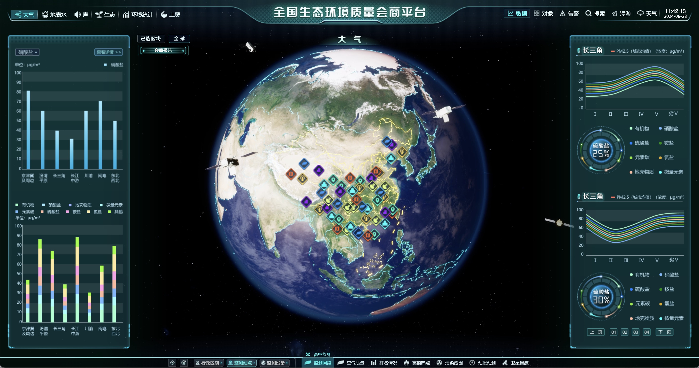
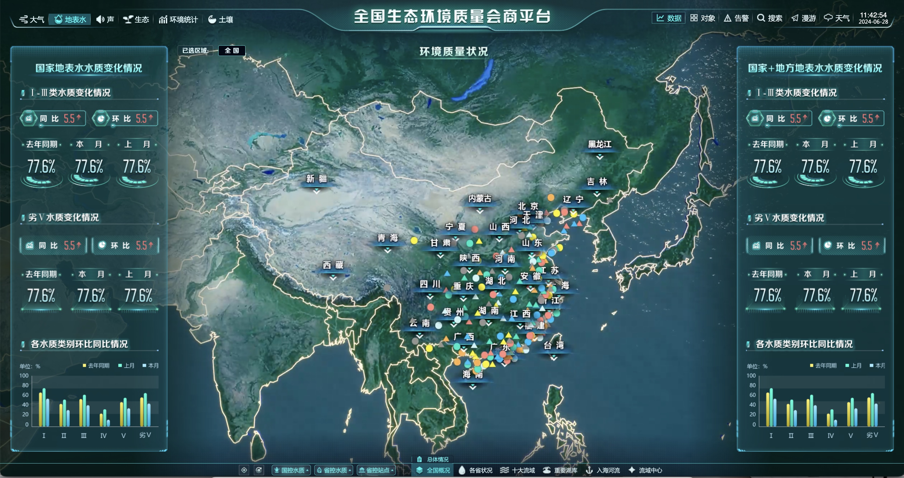

# XJLAB AI新污染物

## 新污染物大屏可视化系统功能

### 1. 实时数据监控
- **污染浓度监控**：持续监测空气、水体、土壤中的新污染物浓度。
- **污染源追踪**：实时跟踪污染源及其扩散路径。

### 2. 动态污染物治理
- **防控措施展示**：展示基于实时数据生成的防污染措施。
- **措施效果评估**：评估并展示不同防控措施的预期环境影响。

### 3. 环境事件预警系统
- **事件实时识别**：自动识别发生的环境污染事件。
- **预警发布**：利用模型预测技术，及时发布污染事件的预警信息。

### 4. 趋势预测与模型推演
- **污染趋势预测**：预测未来的污染物浓度和分布趋势。
- **政策效果模拟**：模拟不同环境政策的实施效果，评估长期影响。

### 5. 智能语音交互
- **语音控制界面**：支持通过语音指令调整数据展示和分析参数。
- **复杂查询解析**：利用自然语言处理技术，理解并执行复杂数据查询。

## 前端技术架构

- **HTML/CSS/JavaScript/React.js**: 用于组件化和响应式前端开发，使用Redux来管理组件间的状态，确保数据频繁更新的情况下界面的一致性。

- **D3.js 和 ECharts**: 这些库用于复杂的数据可视化，如污染物浓度曲线、污染物热点图、污染物百分比等。
- **三维地球建模**:建议使用cesiumJS https://sandcastle.cesium.com/?src=CZML.html

- **WebSocket**: 用于实时数据通信，确保前端可以即时接收后端推送的交通数据更新（主动推流）。

- **WebRTC**: 用于实现实时语音监控功能。

## DemoDesign: http://showcase.tuguan.net/environment/#/dq/gkjc
- 
- 
- 

## 大模型配置

一键运行大模型对话和代码生成的工具在[百度网盘链接](https://pan.baidu.com/s/1n2fJvWff4pbtMe97GOqtvQ?pwd=hutb) 的“学习->大模型”目录下，“WizardLM演示视频.mp4”展示了如何运行和测试这个模型的详细步骤。以下是进行代码调试的环境部署步骤：

1. 将[百度网盘链接](https://pan.baidu.com/s/1n2fJvWff4pbtMe97GOqtvQ?pwd=hutb) 的“学习->大模型->webui”目录中的文件下载；
2. 解压`python.zip`到`gpt/`目录，`WizardCoder-15B-1.0-GPTQ.zip`和`chatglm2-6b.zip`解压到`gpt/models`目录下；
3. 运行`windowsdesktop-runtime-6.0.10-win-x64.exe`安装.Net；
4. 点击`快速启动.exe`运行图形化界面。